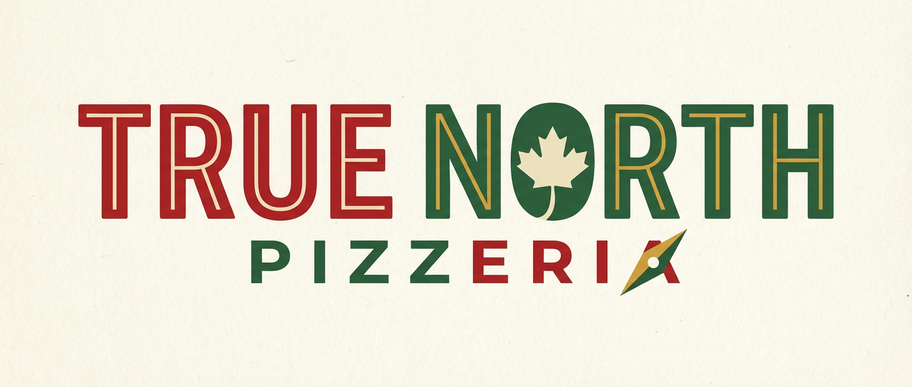
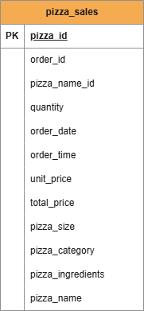
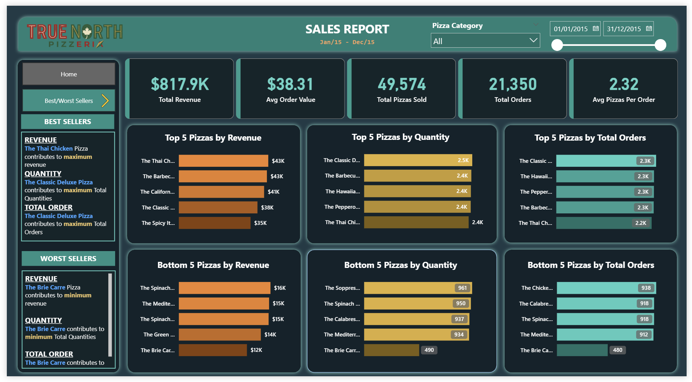

  

# True North Pizzeria Sales Analysis

Sales performance analysis for one year of pizza orders at True North Pizzeria, delivered as a stakeholder ready Power BI dashboard with supporting SQL validation.

## Project Overview

True North Pizzeria completed a full year of operations and wants to understand its sales performance across categories, sizes, products, and time periods. This project analyzes one year of transactional pizza order data to identify performance trends, evaluate menu items, and support data driven decisions in marketing, inventory planning, and daily operations.

The project delivers:
- A stakeholder ready Power BI dashboard summarizing sales performance
- SQL based KPI validation for accuracy and transparency
- Insights on category share, size performance, and product level trends
- Recommendations to guide menu optimization and operational planning

## Data Structure Overview

The analysis is based on a single clean transactional table containing one row per pizza item sold.  
Key fields include order identifiers, timestamps, pizza attributes, pricing, and quantity.

Below is the schema overview for the dataset:

  

## Executive Summary

Across one year of operations, True North Pizzeria generated approximately **CAD 818K** in revenue from **21K** orders and **49K** pizzas sold. Customers typically spend about **CAD 38** per order and purchase around **2.3** pizzas per transaction, with order volume peaking on **Fridays** and remaining high on **Thursdays** and **Saturdays**, while **Sunday** experiences the lowest demand. Monthly trends show clear spikes in **July** and **January**.

**Classic** pizzas are the strongest performing category, and **Large** pizzas drive the highest share of revenue, indicating a clear customer preference for larger, classic style options. At the individual product level, pizzas such as **The Thai Chicken Pizza** and **The Classic Deluxe Pizza** consistently appear among the top sellers, while items like **The Brie Carre Pizza** underperform across revenue, quantity, and order counts.

These patterns highlight an opportunity to double down on high performing categories and sizes while reevaluating weaker items to improve overall menu efficiency and profitability.

  

<em>Main sales performance dashboard in Power BI</em>

## Insights Deep Dive
### Sales Trends Over Time

**Daily Patterns:**  
Order volume is highest on **Fridays**, reaching approximately **3.5K orders**. Thursdays and Saturdays follow with around **3.2K orders**. Midweek demand remains steady on Tuesdays and Wednesdays, while **Sunday** is the slowest day with about **2.6K orders**. This pattern suggests stronger customer activity near the end of the workweek.

**Monthly Patterns:**  
Sales peak during **July** and **January**, each generating around **1.9K orders**. Other months, such as March, April, and August, show stable performance at roughly **1.8K orders**. February and December see lower volume, with **1.6K** orders. These trends indicate seasonal fluctuations, likely influenced by holidays and customer behavior.

### Category and Size Performance

**Category Contribution:**  
Classic pizzas generate the highest share of total revenue at **26.9%**, followed closely by Supreme at **25.5%**, Chicken at **24.0%**, and Veggie at **23.7%**. The distribution is relatively balanced, but Classic pizzas maintain a clear lead, indicating strong customer preference for traditional flavors.

**Size Contribution:**  
Large pizzas are the strongest revenue driver, contributing **45.9%** of total sales. Medium sizes follow at **30.5%**, and Regular sizes contribute **21.8%**. X-Large and XX-Large sizes account for only **1.7%** and **0.1%**, showing minimal demand. The dominance of Large pizzas highlights a strong preference for larger portions and greater value items.

### Product Level Performance

  

<em>Top and bottom pizza performers by revenue, quantity, and orders</em>

**Top Performing Pizzas:**  
Across revenue, quantity, and order counts, several pizzas consistently appear among the strongest performers.  
- **The Thai Chicken Pizza** generates the highest total revenue at **CAD 43.4K**.  
- **The Classic Deluxe Pizza** leads in total quantity sold with **2.45K pizzas** and also ranks highly in total orders.  
- Other strong contributors include **The Barbecue Chicken Pizza**, **The California Chicken Pizza**, and **The Spicy Italian Pizza**.

These products form the core of True North Pizzeria’s menu performance and should remain central to marketing and promotion strategy.

**Underperforming Pizzas:**  
Several pizzas show consistently low sales across all major KPIs.  
- **The Brie Carre Pizza** is the lowest performer in revenue (**CAD 11.6K**), quantity (**490 sold**), and total orders (**480 orders**).  
- Other weak performers include **The Mediterranean Pizza**, **The Spinach Supreme Pizza**, **The Calabrese Pizza**, and **The Chicken Pesto Pizza**.

These items may require targeted promotions, recipe changes, or removal from the menu to improve overall portfolio efficiency.
